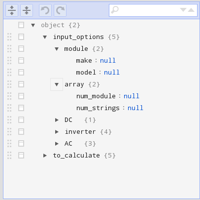
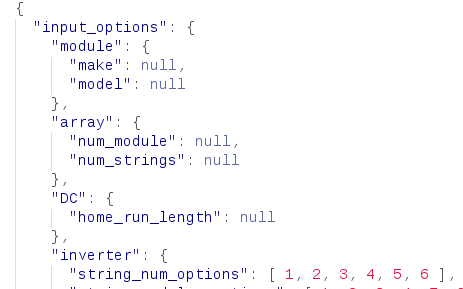

# Plans machine
Updated: 2014-10-23

## Goal
To generate a selection of FSEC pre-approved PV system drawings that will cover a majority of Florida installations.

## Links
* [kshowalter/pv_draw](http://fsec.ucf.edu/~kshowalter/pv_draw)
* [kshowalter/pv_draw_dev](http://fsec.ucf.edu/~kshowalter/pv_draw_dev)

## The process
* A user visits the "plans machine" app on the FSEC website
* The plans machine collects input from the user/customer/installer, calculates system specs., and displays a sample drawing
* Once the system is configured, the configuration code is sent to the server
* The user pays for the permit package
* The user receives a private purchase code, and a public confirmation code
    * The private purchase code is used to download the permit package
    * The public confirmation code is used to verify that the permit package is issued by FSEC
* The user sends the permit package to the AHJ

## Browser application functions
* Allows user to select system components and specifications (ex: number of modules, wire length)
* Calculates the rest of the system specifications
* Displays a sample of the drawing
* Sents the specified configuration to the server

## Server functions

### Demo phase
* Serves plans machine application files to browser (html, js, css)
* Hosts database of system components
    * Modules
    * Inverters
* Provides interface to allow FSEC employees to keep database updated.
* Recieves system configuration from server
* Vefies the congiguration as valid
* Generates a PDF that is sent back to the user via the web app.

### Longterm
The longterm plans are to add:
* Payment processing
* System verification page for AHJs
* Login system for customers (installers)
* Login system for component manufacturers to maintain the component database

## Settings
Many of the settings for the application are stored in JSON formated files.
These are what is commonly called configuration files. The settings define what input is requested from the user, and hopefully most of the calculations for the PV system. Some aspects of the drawing may be specified in the settings files.

The JSON format is not unreasonable for a non-programer to edit in a text editor, and can still be imported directly into the application.
A graphical interface to edit and download the latest version of the setting will be provided.
Examples are shown below.

JSON editor

JSON sample

There are other format options for configuration files that might be easier to edit, but would would comprimise the deepth of settings that could be easily specified.

## Development Phases

### Feature phase
Maintain a list of features, issue fixes, and improvements that will be added to the program up to the end of the phase. Features that do not make it in by the end of the phase, are put aside for future development.

### Cleanup phase
Continue to fix issues, improve existing features, and prepare for release.

### Testing phase
Expand the user test group, and concentrate on fixing issues. Features that are suggested by test users are either added, or stored for later, based on there value, the time needed to add to the application, and the time left until launch.

### Post launch development
Fix issues as quickly as possible, and continue development as time and funding allows.
